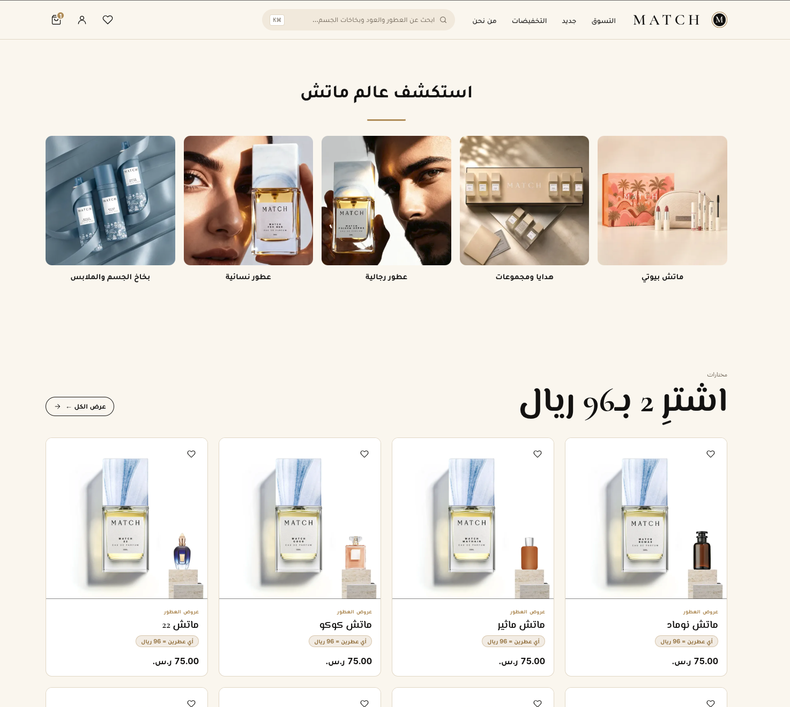
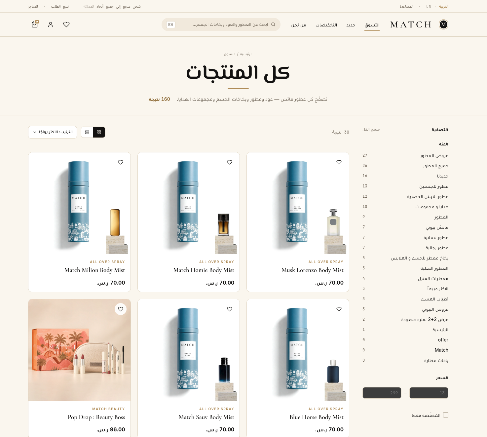
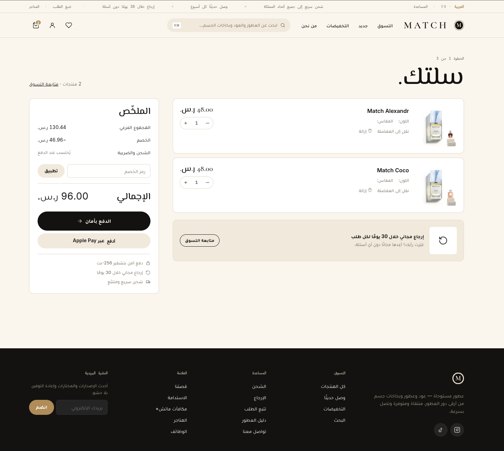
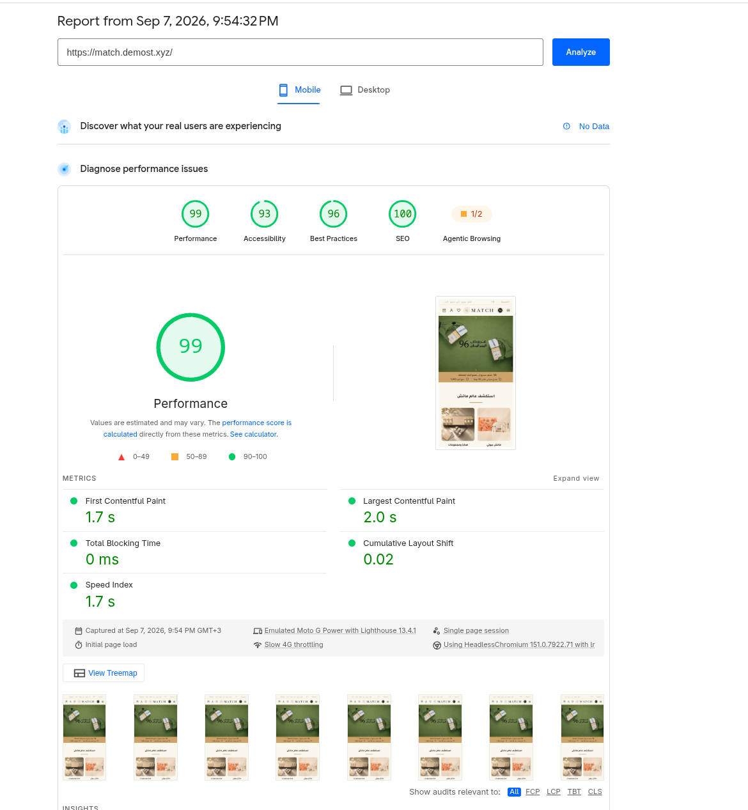

# Headless Commerce on Salla: Proof of Concept

**Live demos:** [demost.xyz](https://demost.xyz) · [match.demost.xyz](https://match.demost.xyz)

Two custom storefronts, designed and built from scratch, running on Salla as their commerce platform. Every product, price, customer, and cart you see is real Salla data from a real Salla store. Salla remains the engine; only the storefront experience is new.


> A real Salla product with live pricing, variants, and stock, rendered in a storefront that owes nothing to the theme system.

---

## What this is

Today, a Salla merchant's storefront lives inside the theme system. This proof of concept demonstrates a different model: the storefront becomes an independent experience, with its own design, and its own identity, while Salla continues to power everything underneath:

- The **product catalog** and inventory
- **Customer accounts** and login (the same trusted Salla login merchants' customers already know)
- **Cart**, and beyond it Salla's own checkout and payments
- **Orders** and the merchant dashboard

The merchant changes nothing about how they run their business. They keep their Salla dashboard, their operations, their data. What changes is the ceiling on what their storefront can look and feel like.

```
   STRIDE (demost.xyz)   MATCH (match.demost.xyz)   ← design, brand:
   ...............................................     independent
   Salla                                             ← catalog, accounts, cart,
                                                        checkout, payments,
                                                        orders, dashboard
```

Two storefronts, two brand worlds, one commerce engine. Nothing about the second one required a new platform, only a new design.

## What the demos show

Visit [demost.xyz](https://demost.xyz) and walk the journey this proof of concept covers:

- **A storefront that doesn't look like a theme**: a distinct brand world with its own design language, built with creative freedom
- **The shopping journey**: browse, search, product pages, wishlist, cart, and login, all powered by Salla
- **Arabic-first, bilingual**: native right-to-left Arabic and English experiences on one store
- **Speed and discoverability**: performance and SEO scores in the top tier, the kind of storefront that ranks and converts
- **Salla stays the source of truth**: a product updated in the Salla dashboard updates here

### The cart is Salla's


> Products, quantities, totals, and discount codes all run through Salla. This proof of concept covers the storefront up to the cart; checkout and payment stay with Salla. The custom layer is presentation only; nothing about the commerce logic is reimplemented.

### It's fast, and it's built to rank


Mobile PageSpeed Insights, measured on the live demos:

| Metric | STRIDE | MATCH |
| --- | --- | --- |
| Performance | **96** | **99** |
| Accessibility | **97** | **93** |
| Best Practices | **96** | **96** |
| SEO | **100** | **100** |

| Core Web Vital | STRIDE | MATCH |
| --- | --- | --- |
| Largest Contentful Paint | 2.4 s | 2.0 s |
| Total Blocking Time | 50 ms | 0 ms |
| Cumulative Layout Shift | 0.006 | 0.02 |
| Speed Index | 2.1 s | 1.7 s |

These are the numbers a premium brand's agency asks for before it will commit to a platform, and they are reached on Arabic RTL catalog storefronts, not on stripped-down landing pages.

### Not a one-off: a second brand on the same model

[match.demost.xyz](https://match.demost.xyz) is **MATCH**, an Arabic-first perfume and body-mist storefront with its own design language, and its own brand world, built on the same headless model and the same Salla foundation.



> A different category, a different visual identity, no trace of a shared theme. Categories, products, prices, and the bundle offer are all live Salla data.



> The catalog: 160 products, faceted by category and price, sorted and paginated, served from Salla and rendered by the custom layer.



> The same story as the first storefront: products, quantities, discounts, and totals come from Salla, and checkout and payment stay with Salla.



The second storefront is the point. Building one custom experience shows it can be done; building a second one, in a different category with a different visual identity and the same commerce engine underneath, shows the model is repeatable. That is what an agency ecosystem needs before it will invest in a platform.

## Why this matters

Shopify's growth story changed when it stopped being just "stores that look like Shopify" and became a platform anyone could build on. Headless commerce unlocked its premium segment: global brands, ambitious agencies, and experiences no theme could deliver, all still running on Shopify underneath.

**Salla is positioned to do the same for MENA, and it has already built the hard part.** The commerce engine, the merchant base, the customer trust, the payments and logistics relationships all exist. What remains is opening a supported path for developers and brands to build on top of it.

## The opportunity

- **Premium storefronts**: brands that today outgrow themes (and leave for custom builds) stay on Salla instead
- **An agency and developer ecosystem**: a new class of partners building differentiated experiences, all of it running on Salla
- **Merchant flexibility without migration**: the same store can power a website, a campaign site, or an entirely new brand experience
- **A larger ecosystem**: every headless storefront deepens the platform's gravity, more builders, more integrations, more reasons to choose Salla first

---

**See it for yourself:** [demost.xyz](https://demost.xyz) · [match.demost.xyz](https://match.demost.xyz)
