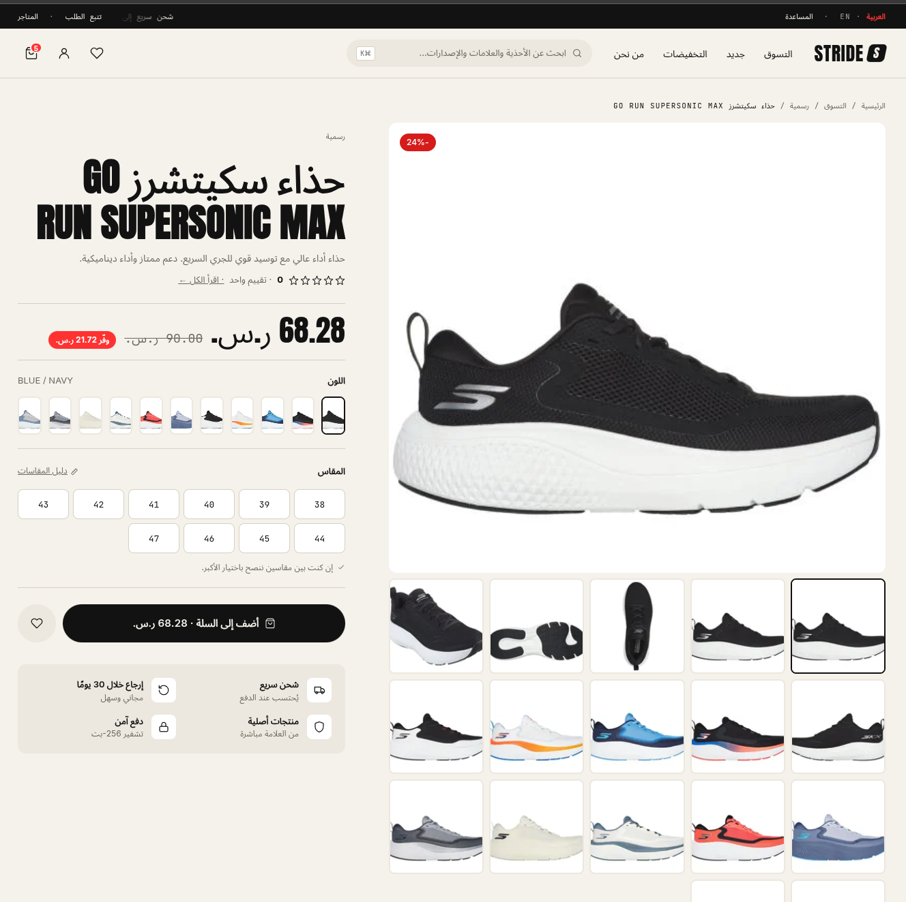
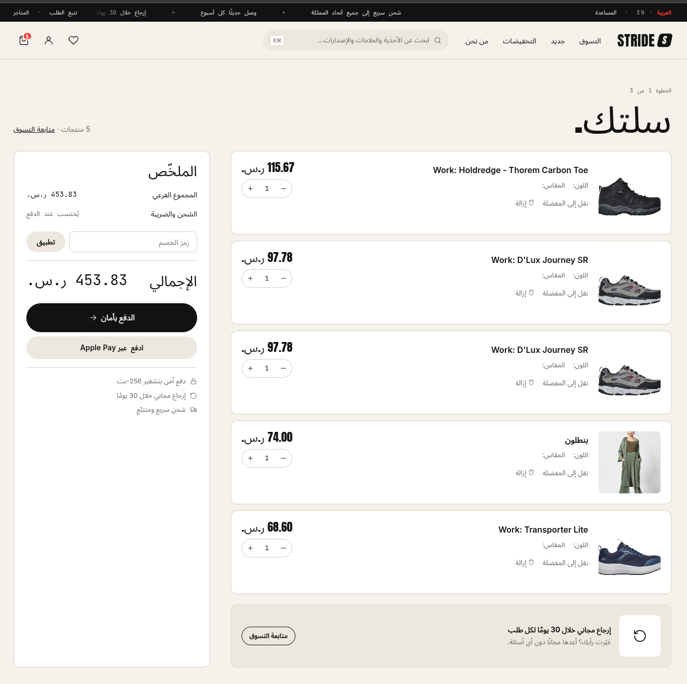
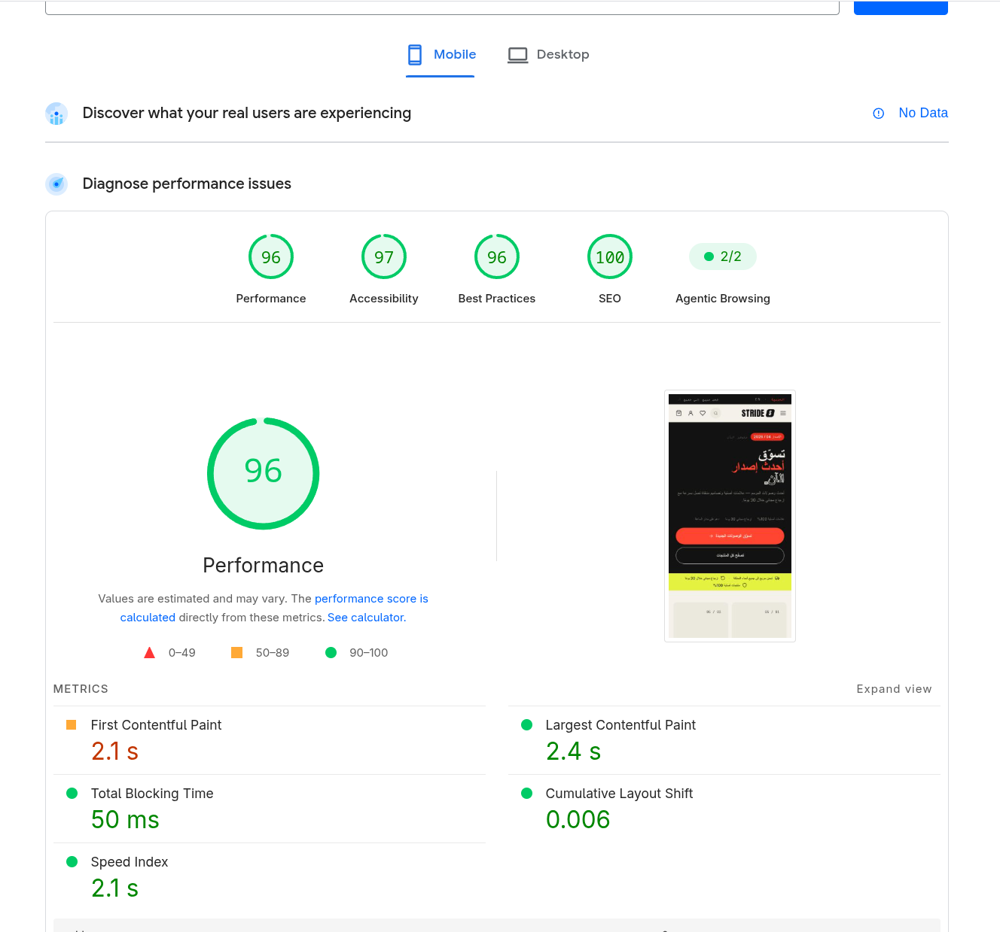

# Headless Commerce on Salla — Proof of Concept

**Live demo:** [demost.xyz](https://demost.xyz)

A fully functional, completely custom storefront — designed and built from scratch — running entirely on Salla as its commerce platform. Every product, price, customer, cart, and order you see is real Salla data from a real Salla store. Salla remains the engine; only the storefront experience is new.



> A real Salla product — live pricing, variants, and stock — rendered in a storefront that owes nothing to the theme system.

---

## What this is

Today, a Salla merchant's storefront lives inside the theme system. This proof of concept demonstrates a different model: the storefront becomes a fully independent experience — its own design, its own domain, its own identity — while Salla continues to power everything underneath:

- The **product catalog** and inventory
- **Customer accounts** and login (the same trusted Salla login merchants' customers already know)
- **Cart, checkout, and payments**
- **Orders** and the merchant dashboard

The merchant changes nothing about how they run their business. They keep their Salla dashboard, their operations, their data. What changes is the ceiling on what their storefront can look and feel like.

```
   Custom storefront (demost.xyz)      ← design, domain, brand: fully independent
   ─────────────────────────────
   Salla                               ← catalog, accounts, cart, checkout,
                                          payments, orders, dashboard
```

## What the demo shows

Visit [demost.xyz](https://demost.xyz) and walk the full journey a customer would:

- **A storefront that doesn't look like a theme** — a distinct brand world with its own design language, built with complete creative freedom
- **The complete shopping journey** — browse, search, product pages, wishlist, cart, login, checkout, and order history — all powered by Salla end to end
- **Arabic-first, fully bilingual** — native right-to-left Arabic and English experiences on one store
- **Speed and discoverability** — performance and SEO scores in the top tier, the kind of storefront that ranks and converts
- **Salla stays the source of truth** — a product updated in the Salla dashboard updates here; an order placed here appears in the merchant's Salla orders

### The cart and checkout are Salla's



> Quantities, totals, discount codes, and payment — including Apple Pay — all run through Salla. The custom layer is presentation only; nothing about the commerce logic is reimplemented.

### It's fast, and it's built to rank



Mobile PageSpeed Insights, measured on the live demo:

| Metric | Score |
| --- | --- |
| Performance | **96** |
| Accessibility | **97** |
| Best Practices | **96** |
| SEO | **100** |

| Core Web Vital | Value |
| --- | --- |
| Largest Contentful Paint | 2.4 s |
| Total Blocking Time | 50 ms |
| Cumulative Layout Shift | 0.006 |
| Speed Index | 2.1 s |

These are the numbers a premium brand's agency asks for before it will commit to a platform — and they are reached on a full Arabic RTL catalog storefront, not a stripped-down landing page.

## Why this matters

Shopify's growth story changed when it stopped being just "stores that look like Shopify" and became a platform anyone could build on. Headless commerce unlocked its premium segment: global brands, ambitious agencies, and experiences no theme could deliver — all still running on Shopify underneath.

**Salla is positioned to do the same for MENA — and it has already built the hard part.** The commerce engine, the merchant base, the customer trust, the payments and logistics relationships all exist. What remains is opening a supported path for developers and brands to build on top of it.

## The opportunity

- **Premium storefronts** — brands that today outgrow themes (and leave for custom builds) stay on Salla instead
- **An agency and developer ecosystem** — a new class of partners building differentiated experiences, all of it running on Salla
- **Merchant flexibility without migration** — the same store can power a website, a campaign site, or an entirely new brand experience
- **A larger ecosystem** — every headless storefront deepens the platform's gravity: more builders, more integrations, more reasons to choose Salla first

---

**See it for yourself:** [demost.xyz](https://demost.xyz)
